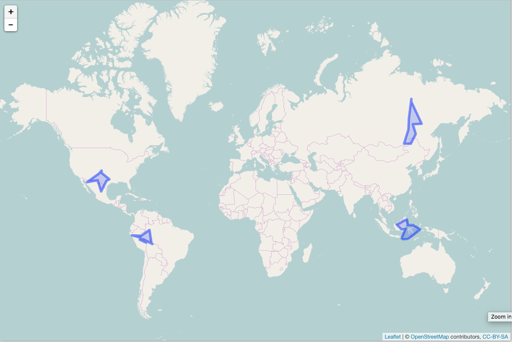

randgeo: random WKT and GeoJSON
===============================


[](https://travis-ci.org/ropensci/randgeo)
[](https://codecov.io/github/ropensci/randgeo?branch=master)
[](https://github.com/metacran/cranlogs.app)
[](https://cran.r-project.org/package=randgeo)

**randgeo** generates random points and shapes in GeoJSON and WKT formats for use
in examples, teaching, or statistical applications.

Points and shapes are generated in the long/lat coordinate system and with
appropriate spherical geometry; random points are distributed evenly across
the globe, and random shapes are sized according to a maximum great-circle
distance from the center of the shape. 

**randgeo** was adapted from <https://github.com/tmcw/geojson-random> to have a pure R
implementation without any dependencies as well as appropriate geometry. Data generated
by **randgeo** may be processed or displayed of with packages such as
[**sf**](https://cran.r-project.org/package=sf),
[**wicket**](https://cran.r-project.org/package=wicket),
[**geojson**](https://cran.r-project.org/package=geojson),
[**wellknown**](https://cran.r-project.org/package=wellknown),
[**geojsonio**](https://cran.r-project.org/package=geojsonio), or
[**lawn**](https://cran.r-project.org/package=lawn).

Package API:

* `rg_position` - random position (lon, lat)
* `geo_point` - random GeoJSON point
* `geo_polygon` - random GeoJSON polygon
* `wkt_point` - random WKT point
* `wkt_polygon` - random WKT polygon

## Docs

<https://ropensci.github.io/randgeo/>

## Install

Stabler CRAN version


```r
install.packages("randgeo")
```

Development version


```r
devtools::install_github("ropensci/randgeo")
```


```r
library("randgeo")
```

## Generate a random position


```r
rg_position()
#> [[1]]
#> [1] 123.9114  28.7060
```

## Genrate random GeoJSON

Random point - evenly distributed across the sphere.  The `bbox` option allows
you to limit points to within long/lat bounds.


```r
geo_point()
#> $type
#> [1] "FeatureCollection"
#> 
#> $features
#> $features[[1]]
#> $features[[1]]$type
#> [1] "Feature"
#> 
#> $features[[1]]$geometry
#> $features[[1]]$geometry$type
#> [1] "Point"
#> 
#> $features[[1]]$geometry$coordinates
#> [1] 91.63560 11.12243
#> 
#> 
#> $features[[1]]$properties
#> list()
```

Random polygon - centered on a random point, with default maximum size


```r
geo_polygon()
#> $type
#> [1] "FeatureCollection"
#> 
#> $features
#> $features[[1]]
#> $features[[1]]$type
#> [1] "Feature"
#> 
#> $features[[1]]$geometry
#> $features[[1]]$geometry$type
#> [1] "Polygon"
#> 
#> $features[[1]]$geometry$coordinates
#> $features[[1]]$geometry$coordinates[[1]]
#> $features[[1]]$geometry$coordinates[[1]][[1]]
#> [1] 167.5056  11.7631
#> 
#> $features[[1]]$geometry$coordinates[[1]][[2]]
#> [1] 169.932405  -1.716375
#> 
#> $features[[1]]$geometry$coordinates[[1]][[3]]
#> [1] 163.440217   2.163558
#> 
#> $features[[1]]$geometry$coordinates[[1]][[4]]
#> [1] 160.50593477   0.07725084
#> 
#> $features[[1]]$geometry$coordinates[[1]][[5]]
#> [1] 156.2431251  -0.7218273
#> 
#> $features[[1]]$geometry$coordinates[[1]][[6]]
#> [1] 154.4680334   0.0508432
#> 
#> $features[[1]]$geometry$coordinates[[1]][[7]]
#> [1] 152.965884   4.109539
#> 
#> $features[[1]]$geometry$coordinates[[1]][[8]]
#> [1] 161.803351   5.745208
#> 
#> $features[[1]]$geometry$coordinates[[1]][[9]]
#> [1] 161.771682   6.510662
#> 
#> $features[[1]]$geometry$coordinates[[1]][[10]]
#> [1] 162.30199  11.74731
#> 
#> $features[[1]]$geometry$coordinates[[1]][[11]]
#> [1] 167.5056  11.7631
#> 
#> 
#> 
#> 
#> $features[[1]]$properties
#> list()
```

Visualize your shapes with **lawn**.


```r
lawn::view(jsonlite::toJSON(geo_polygon(count = 4), auto_unbox = TRUE))
```




## Generate random WKT

Random point


```r
wkt_point()
#> [1] "POINT (-156.8267949 1.0421837)"
```

Random polygon


```r
wkt_polygon()
#> [1] "POLYGON ((-39.6435291 -35.6439781, -50.8816485 -37.1900222, -56.3625756 -41.0998361, -52.4500131 -36.5888093, -56.2291407 -36.3080232, -57.3634195 -35.4103150, -55.7971759 -34.6454685, -60.6118766 -33.4285820, -58.9087262 -31.8995220, -53.2012409 -32.4368328, -39.6435291 -35.6439781))"
```

## Meta

* Please [report any issues or bugs](https://github.com/ropensci/randgeo/issues).
* License: MIT
* Get citation information for `randgeo` in R doing `citation(package = 'randgeo')`
* Please note that this project is released with a [Contributor Code of Conduct](CONDUCT.md). By participating in this project you agree to abide by its terms.

[](https://ropensci.org)
