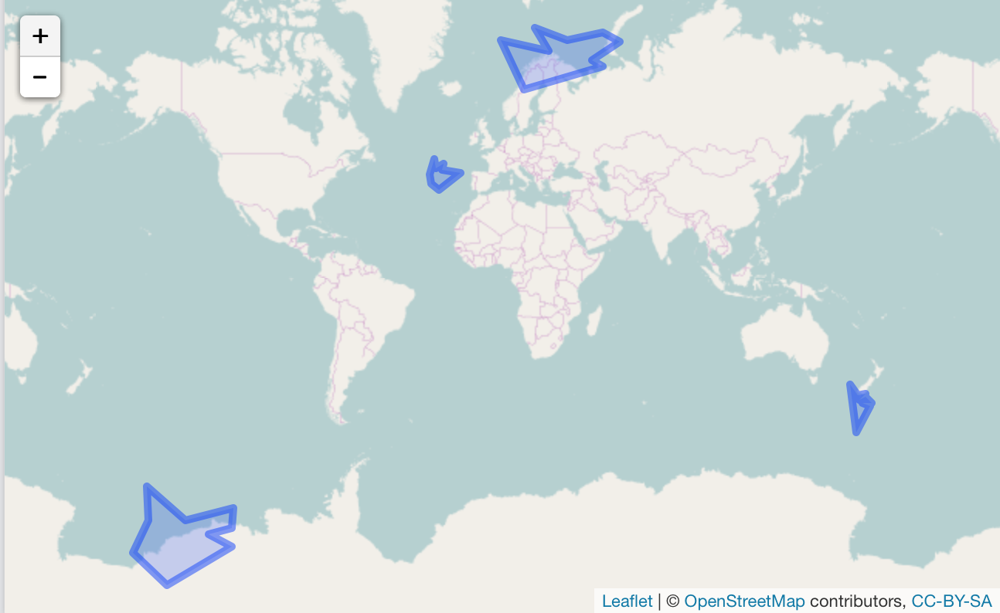

randgeo: random WKT and GeoJSON
===============================


[](https://travis-ci.org/ropensci/randgeo)
[](https://codecov.io/github/ropensci/randgeo?branch=master)
[](https://github.com/metacran/cranlogs.app)
[](https://cran.r-project.org/package=randgeo)

**randgeo** generates random points and shapes in GeoJSON and WKT formats for use
in examples, teaching, or statistical applications.

Points and shapes are generated in the long/lat coordinate system and with
appropriate spherical geometry; random points are distributed evenly across
the globe, and random shapes are sized according to a maximum great-circle
distance from the center of the shape. 

**randgeo** was adapted from <https://github.com/tmcw/geojson-random> to have a pure R
implementation without any dependencies as well as appropriate geometry. Data generated
by **randgeo** may be processed or displayed of with packages such as
[**sf**](https://cran.r-project.org/package=sf),
[**wicket**](https://cran.r-project.org/package=wicket),
[**geojson**](https://cran.r-project.org/package=geojson),
[**wellknown**](https://cran.r-project.org/package=wellknown),
[**geojsonio**](https://cran.r-project.org/package=geojsonio), or
[**lawn**](https://cran.r-project.org/package=lawn).

Package API:

* `rg_position` - random position (lon, lat)
* `geo_point` - random GeoJSON point
* `geo_linestring` - random GeoJSON linestring
* `geo_polygon` - random GeoJSON polygon
* `wkt_point` - random WKT point
* `wkt_linestring` - random WKT linestring
* `wkt_polygon` - random WKT polygon

## Docs

<https://ropensci.github.io/randgeo/>

## Install

Stabler CRAN version


```r
install.packages("randgeo")
```

Development version


```r
devtools::install_github("ropensci/randgeo")
```


```r
library("randgeo")
```

## Generate a random position


```r
rg_position()
#> [[1]]
#> [1]  76.80991 -24.68563
```

## Generate random GeoJSON

Random point - evenly distributed across the sphere.  The `bbox` option allows
you to limit points to within long/lat bounds.


```r
geo_point()
#> $type
#> [1] "FeatureCollection"
#> 
#> $features
#> $features[[1]]
#> $features[[1]]$type
#> [1] "Feature"
#> 
#> $features[[1]]$geometry
#> $features[[1]]$geometry$type
#> [1] "Point"
#> 
#> $features[[1]]$geometry$coordinates
#> [1] 142.37810  26.72286
#> 
#> 
#> $features[[1]]$properties
#> NULL
#> 
#> 
#> 
#> attr(,"class")
#> [1] "geo_list"
```

Random linestring - starting from a random point, with default maximum segment
length and maximum rotation between two segments.


```r
geo_linestring()
#> $type
#> [1] "FeatureCollection"
#> 
#> $features
#> $features[[1]]
#> $features[[1]]$type
#> [1] "Feature"
#> 
#> $features[[1]]$geometry
#> $features[[1]]$geometry$type
#> [1] "LineString"
#> 
#> $features[[1]]$geometry$coordinates
#> $features[[1]]$geometry$coordinates[[1]]
#> $features[[1]]$geometry$coordinates[[1]][[1]]
#> [1] -131.47015  -58.46389
#> 
#> $features[[1]]$geometry$coordinates[[1]][[2]]
#> [1] -131.47063  -58.46406
#> 
#> $features[[1]]$geometry$coordinates[[1]][[3]]
#> [1] -131.46932  -58.46451
#> 
#> $features[[1]]$geometry$coordinates[[1]][[4]]
#> [1] -131.47059  -58.46512
#> 
#> $features[[1]]$geometry$coordinates[[1]][[5]]
#> [1] -131.47040  -58.46529
#> 
#> $features[[1]]$geometry$coordinates[[1]][[6]]
#> [1] -131.47112  -58.46583
#> 
#> $features[[1]]$geometry$coordinates[[1]][[7]]
#> [1] -131.47100  -58.46595
#> 
#> $features[[1]]$geometry$coordinates[[1]][[8]]
#> [1] -131.47093  -58.46666
#> 
#> $features[[1]]$geometry$coordinates[[1]][[9]]
#> [1] -131.47089  -58.46674
#> 
#> $features[[1]]$geometry$coordinates[[1]][[10]]
#> [1] -131.47079  -58.46772
#> 
#> 
#> 
#> 
#> $features[[1]]$properties
#> NULL
#> 
#> 
#> 
#> attr(,"class")
#> [1] "geo_list"
```

Random polygon - centered on a random point, with default maximum size


```r
geo_polygon()
#> $type
#> [1] "FeatureCollection"
#> 
#> $features
#> $features[[1]]
#> $features[[1]]$type
#> [1] "Feature"
#> 
#> $features[[1]]$geometry
#> $features[[1]]$geometry$type
#> [1] "Polygon"
#> 
#> $features[[1]]$geometry$coordinates
#> $features[[1]]$geometry$coordinates[[1]]
#> $features[[1]]$geometry$coordinates[[1]][[1]]
#> [1]  59.92561 -73.65831
#> 
#> $features[[1]]$geometry$coordinates[[1]][[2]]
#> [1]  71.28926 -70.06012
#> 
#> $features[[1]]$geometry$coordinates[[1]][[3]]
#> [1]  65.29723 -75.22029
#> 
#> $features[[1]]$geometry$coordinates[[1]][[4]]
#> [1]  75.70817 -74.74052
#> 
#> $features[[1]]$geometry$coordinates[[1]][[5]]
#> [1]  67.47201 -76.67516
#> 
#> $features[[1]]$geometry$coordinates[[1]][[6]]
#> [1]  96.37634 -79.72573
#> 
#> $features[[1]]$geometry$coordinates[[1]][[7]]
#> [1]  82.38431 -81.35166
#> 
#> $features[[1]]$geometry$coordinates[[1]][[8]]
#> [1]  51.55175 -78.98859
#> 
#> $features[[1]]$geometry$coordinates[[1]][[9]]
#> [1]  52.01242 -76.47304
#> 
#> $features[[1]]$geometry$coordinates[[1]][[10]]
#> [1]  57.76775 -77.08575
#> 
#> $features[[1]]$geometry$coordinates[[1]][[11]]
#> [1]  59.92561 -73.65831
#> 
#> 
#> 
#> 
#> $features[[1]]$properties
#> NULL
#> 
#> 
#> 
#> attr(,"class")
#> [1] "geo_list"
```

Visualize your shapes with **lawn**.


```r
lawn::view(jsonlite::toJSON(geo_polygon(count = 4), auto_unbox = TRUE))
```




## Generate random WKT

Random point


```r
wkt_point()
#> [1] "POINT (10.4790723 -40.6741089)"
```

Random linestring


```r
wkt_linestring()
#> [1] "LINESTRING ((-77.4164210 -33.8041786, -77.4163745 -33.8041324, -77.4163993 -33.8040712, -77.4163742 -33.8039840, -77.4163635 -33.8039218, -77.4163869 -33.8038818, -77.4163520 -33.8037866, -77.4163601 -33.8037617, -77.4163525 -33.8037472, -77.4163698 -33.8037213))"
```

Random polygon


```r
wkt_polygon()
#> [1] "POLYGON ((64.7274829 5.1986678, 69.4220541 10.5194128, 66.8564189 7.4339661, 71.2231323 5.6555656, 63.0544951 1.8508059, 62.5580665 0.9490145, 59.4178802 2.3278836, 62.6446303 5.0888115, 62.2554080 6.1454992, 57.5336007 10.1978140, 64.7274829 5.1986678))"
```

## Meta

* Please [report any issues or bugs](https://github.com/ropensci/randgeo/issues).
* License: MIT
* Get citation information for `randgeo` in R doing `citation(package = 'randgeo')`
* Please note that this project is released with a [Contributor Code of Conduct](CONDUCT.md). By participating in this project you agree to abide by its terms.

[](https://ropensci.org)
